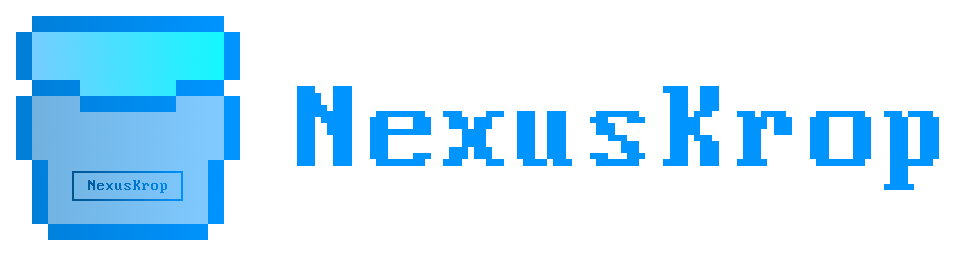

## Hi there 👋

This is **NexusKrop** project. We make game mods, game related stuff as well as generic software.

### Contributing to the project

Varies. Follow the guidelines if there is one in the repo you wanna contribute to; if not, it's probably wise to follow the Covenant.

<!--

**Here are some ideas to get you started:**

🙋‍♀️ A short introduction - what is your organization all about?
🌈 Contribution guidelines - how can the community get involved?
👩‍💻 Useful resources - where can the community find your docs? Is there anything else the community should know?
🍿 Fun facts - what does your team eat for breakfast?
🧙 Remember, you can do mighty things with the power of [Markdown](https://docs.github.com/github/writing-on-github/getting-started-with-writing-and-formatting-on-github/basic-writing-and-formatting-syntax)
-->
